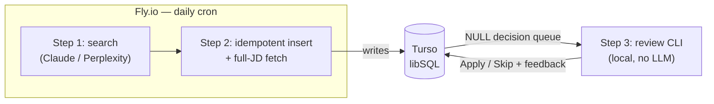

# Job Search Agent

A personal job-search agent, built on the [Claude Agent SDK](https://docs.claude.com/en/api/agent-sdk/overview), that runs a **daily search** for Customer Education / Enablement / Community roles, stores each posting **exactly once** (with its full job description), and collects fit feedback through a fast terminal review loop.

> This repository doubles as a portfolio example of building a real system with AI coding tools. The design was worked out as a written spec **before** any code: [`prd.md`](./prd.md) is the source of truth, [`TODO.md`](./TODO.md) tracks open decisions, and [`deep_research_prompt.md`](./deep_research_prompt.md) is the search prompt itself. See [How this was built](#how-this-was-built).

## Status

**In development.** This repo implements **Steps 1–3** of the PRD:

| Step | What it does | Where it runs |
| --- | --- | --- |
| 1 | Daily job search, alternating Claude Deep Research (even days) and Perplexity Pro Search (odd days) | Fly.io cron (headless) |
| 2 | Idempotent insert into Turso + full-JD capture from the posting's own ATS | Fly.io cron (headless) |
| 3 | Human-in-the-loop fit review (`Apply`/`Skip` + free-text feedback) | Local terminal |

Steps 4–5 (per-job resume revisions, Google Sheet application tracker) and the “ground truth” prompt-refinement cron are specified in `prd.md` and will be built later.

## Architecture

The system splits a **headless cloud runtime** (the daily search) from **interactive local sessions** (review), coordinated through one hosted database so neither side keeps a divergent copy.



- **Fly.io** wakes a machine on schedule, runs one search, and stops — pennies per month.
- **Turso** (hosted, SQLite-compatible libSQL) is the single `postings` table both sides share.
- **Idempotency** is one mechanism: URL canonicalization into a `UNIQUE` constraint with `INSERT … ON CONFLICT DO NOTHING`, so overlapping search windows and re-runs are safe.

## Setup

Requires [uv](https://docs.astral.sh/uv/) and Python 3.12+.

```bash
uv sync                     # create the venv and install dependencies
cp .env.example .env        # then fill in credentials (see below)
```

Credentials (see `.env.example` for details): a Turso database URL + token, an Anthropic API key (A-day search), and a Perplexity API key (B-day search).

## Usage

```bash
uv run jsa init-db                              # create the postings table
uv run jsa search                              # run today's search (agent auto-selected by date)
uv run jsa search --agent perplexity --window-hours 72   # explicit agent + window
uv run jsa review                              # work through the fit-review backlog
```

A full local + Fly.io runbook is added as the deployment is built out.

## How this was built

_(Portfolio section — completed alongside the implementation: the spec-first workflow, the decision log in `TODO.md`, and how Claude Code drove the build.)_
