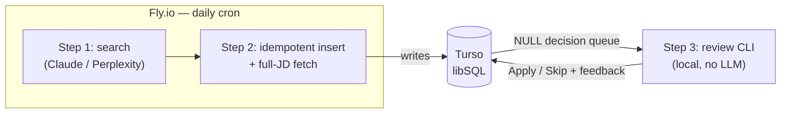

# Job Search Agent

A personal job-search agent, built on the [Claude Agent SDK](https://docs.claude.com/en/api/agent-sdk/overview), that runs a **daily search** for Customer Enablement / Education / AI Enablement roles, stores each posting **exactly once** (with its full job description), and collects fit feedback through a fast terminal review loop.

> This repository doubles as a portfolio example of building a real system with AI coding tools. The design was worked out as a written spec **before** any code: [`prd.md`](./prd.md) is the source of truth, [`TODO.md`](./TODO.md) tracks open decisions, and [`deep_research_prompt.md`](./deep_research_prompt.md) is the search prompt itself. See [How this was built](#how-this-was-built).

## Status

**In development.** This repo implements **Steps 1–3 and 5** of the PRD:

| Step | What it does | Where it runs |
| --- | --- | --- |
| 1 | Daily job search, alternating Claude Deep Research (even days) and Perplexity Agent API deep research (odd days) | Fly.io cron (headless) |
| 2 | Idempotent insert into Turso + full-JD capture from the posting's own ATS | Fly.io cron (headless) |
| — | Direct job add: hand it a URL, it runs the same Step 2 machinery and is decided `Apply` | Local terminal |
| 3 | Human-in-the-loop fit review (`Apply`/`Skip` + free-text feedback) | Local terminal |
| 5 | Append `Apply` postings to the Google Sheet application tracker | Local terminal |

Step 4 (per-job resume revisions) and the “ground truth” prompt-refinement cron are specified in `prd.md` and will be built later. Until Step 4 exists, Step 5 is triggered by hand off the `Apply` decision rather than off a generated resume packet — see the interim note in `prd.md`.

## Architecture

The system splits a **headless cloud runtime** (the daily search) from **interactive local sessions** (review), coordinated through one hosted database so neither side keeps a divergent copy.


```mermaid
flowchart LR
    subgraph Cloud ["Fly.io — daily cron"]
        S["Step 1: search\n(Claude / Perplexity)"] --> I["Step 2: idempotent insert\n+ full-JD fetch"]
    end
    I -->|writes| DB[("Turso\nlibSQL")]
    DB -->|NULL decision queue| R["Step 3: review CLI\n(local, no LLM)"]
    R -->|Apply / Skip + feedback| DB
```

- **Fly.io** wakes a machine on schedule, runs one search, and stops — pennies per month.
- **Turso** (hosted, SQLite-compatible libSQL) is the single `postings` table both sides share.
- **Idempotency** is one mechanism: URL canonicalization into a `UNIQUE` constraint with `INSERT … ON CONFLICT DO NOTHING`, so overlapping search windows and re-runs are safe.

## Setup

Requires [uv](https://docs.astral.sh/uv/) and Python 3.12+.

```bash
uv sync                     # create the venv and install dependencies
cp .env.example .env        # then fill in credentials (see below)
```

Credentials (see `.env.example` for details): a Turso database URL + token, an Anthropic API key (A-day search), and a Perplexity API key (B-day search).

## Usage

```bash
uv run jsa init-db                              # create the postings table
uv run jsa search                              # run today's search (agent auto-selected by date)
uv run jsa search --agent perplexity --window-hours 72   # explicit agent + window
uv run jsa add https://job-boards.greenhouse.io/acme/jobs/123   # add one posting by hand
uv run jsa review                              # work through the fit-review backlog
uv run jsa refetch --dry-run                   # report drift on Apply postings not yet applied to
uv run jsa packet --dry-run                    # preview the application-packet directories
uv run jsa track --dry-run                     # preview the tracker rows
uv run jsa track                               # append Apply postings to the Sheet
```

### Adding a posting by hand

`jsa add <URL>` runs a user-supplied posting through the *same* pipeline as a
searched one — canonicalize, idempotent insert, full-JD capture — tagged
`search_agent = 'manual'`.

**It is decided `Apply` on arrival.** Supplying the URL is the decision, so the
posting skips the review backlog and goes straight into the tracker queue, ready
for `jsa track`. Adding a URL already in the table promotes that row to `Apply`
too (keeping any feedback you wrote about it), so handing over a posting you'd
previously skipped is how you reverse that call.

Company and title are pre-filled from the ATS record and the board slug for you
to correct; `--company` / `--title` set them outright and `--no-input` skips the
prompts.

A URL on an unsupported ATS (Workday, a custom careers site) still works: the
job description is captured from the page's schema.org JSON-LD, which most job
pages embed so they can appear in Google Jobs. Capture order is supported ATS
fetcher → JSON-LD → `NULL` — the platform's own record wins where it exists,
since it is fuller and carries a structured location. This fallback is only for
postings *you* hand over: it proves what a posting says, never that it's still
open, so the search path doesn't use it.

### Reviewing

`jsa review` walks the backlog, opening each posting in Chrome. Decisions are
revisable, because articulating *why* a role is a Skip is often what reveals
it's an Apply:

| Key | Where | What it does |
| --- | --- | --- |
| `a` / `s` | decision prompt | Apply / Skip |
| `b` | decision prompt | step back to the previous posting and reopen it (Enter keeps its decision; its comment is pre-filled for editing) |
| `q` | decision prompt | stop (everything already decided is saved) |
| `:a` / `:s` | feedback prompt | change the decision; text typed after the command is kept as the comment |
| `:b` | feedback prompt | discard and return to the decision prompt |

At the end of the backlog you get one more chance to amend the last entry. The
prompts have real line editing — arrow keys, ⌥+delete, ^W, ^A/^E — and
Ctrl-X Ctrl-E opens `$EDITOR` for a long comment.

### Keeping postings in sync

Employers edit reqs in place. A Stepful posting in this database was retitled
from "Fractional GTM Enablement Lead" to "Fractional Sales Enablement Lead"
under an unchanged URL and posted-date. Since the job description is captured
once at insert time (deliberately — it has to be captured while the posting is
alive), a row can drift from its source.

`jsa refetch` re-reads the ATS record and re-applies the insert's rule: the
ATS-canonical title wins and `title_slug` is re-derived from it, with the
description and location refreshed alongside. A failed fetch leaves the row
untouched rather than trading a good capture for a blip, and a posting that has
vanished from its board is reported, not deleted.

It focuses on the postings where drift could still change what you do next:
`Apply` rows that are either absent from the tracker Sheet *or* sitting there
without a `Date Applied`. The database is the source of truth and the tracker
is its human-readable projection, so a corrected title is also written back to
the tracker row's Title cell (matched by the ID column) when the job hasn't
been applied to — and once you *have* applied, the row is skipped entirely and
its sheet copy stays frozen as the record of what you submitted. The Sheet
index read fails loudly in the default scope rather than guessing; under
`--id`/`--all` it's best-effort and only enables the Title refresh.

If the job already has a packet directory, a title or JD change **rebuilds
it** — new name, fresh `job_posting.md`. The packet is a derived artifact
(the resume, once Step 4 exists, is regenerated from the base resume plus the
JD), so the stale copy is deleted rather than archived, and the missing resume
is itself the regenerate signal. The delete only ever targets the exact
expected old directory, and a location-only change touches nothing.

```bash
uv run jsa refetch --dry-run   # what has changed upstream, without writing
uv run jsa refetch             # reconcile Apply postings not yet applied to
uv run jsa refetch --all       # every stored row, regardless of decision or tracker state
uv run jsa refetch --id 42     # one row, selected unconditionally
```

### Preparing application packets

`jsa packet` builds the per-job application-packet directory — the
deterministic first half of Step 4 (the resume tailoring itself is still to
come). For each `Apply` posting not yet in the tracker it creates
`~/Documents/Job Applications/{Company} - {Title}` with a fail-if-exists
`mkdir` (an existing packet is skipped, never clobbered) and writes the
captured job description inside as `job_posting.md`. Since `jsa track`
currently runs at Apply time, `--id` builds the packet for a row that's
already tracked.

```bash
uv run jsa packet --dry-run    # what would be created
uv run jsa packet --id 42      # one packet, even if the row is already tracked
```

### Elevating to the tracker

`jsa track` appends every `Apply` posting that isn't in the tracker yet to the
Google Sheet, then flags the row `added_to_tracker = 1`. Each row leads with
the database id (column A), which is how `jsa refetch` matches Sheet rows back
to postings. The flag is set **only**
after the Sheets API confirms the append, so a failure leaves the posting in the
backlog rather than silently dropping it; re-running never double-appends.
The write shells out to the local [`gws`](https://github.com/googleworkspace/cli)
CLI, which holds the Google OAuth token — that credential stays off the Fly.io
server by design. If `gws` reports an expired grant, re-run `gws auth login`.

```bash
uv run jsa track --dry-run     # print the exact rows without writing
uv run jsa track --id 42       # elevate one posting
```

## Deployment (Fly.io + Turso)

Steps 1–2 run headless on a Fly.io Machine that wakes daily, runs one search, and
stops. Steps 3 (and later 4–5) run locally against the same Turso database.

> The commands below are run **by you** — they create billed accounts and set
> secrets that must never pass through an agent transcript.

**1. Turso database.** Install the [Turso CLI](https://docs.turso.tech/cli/installation), then:

```bash
turso auth signup
turso db create job-search-agent
turso db show job-search-agent --url          # -> TURSO_DATABASE_URL
turso db tokens create job-search-agent       # -> TURSO_AUTH_TOKEN
```

Put both in your local `.env`, then `uv run jsa init-db` to create the table.

**2. API keys.** Create an [Anthropic API key](https://console.anthropic.com/) (with
billing enabled — A-day runs are Opus deep-research sessions) and a
[Perplexity API key](https://www.perplexity.ai/settings/api). Add both to `.env`
for local runs.

**3. Fly app + secrets.** Install [flyctl](https://fly.io/docs/flyctl/install/), then:

```bash
fly auth signup                # or: fly auth login
fly launch --no-deploy         # reuses the committed fly.toml
fly secrets set --stage \      # --stage is required: this app has no `fly deploy` release,
  TURSO_DATABASE_URL="libsql://..." \   # so plain `fly secrets set` fails trying to auto-deploy
  TURSO_AUTH_TOKEN="..." \               # against a release that doesn't exist
  ANTHROPIC_API_KEY="sk-ant-..." \
  PERPLEXITY_API_KEY="pplx-..."
```

**4. Smoke-test once, then schedule.** Run a one-off machine (no schedule) and
check logs + new Turso rows before letting the cron ride. `fly machine run`
talks to the Machines API directly and does **not** read `fly.toml`'s `[[vm]]`
block (that's only consumed by `fly deploy`) — pass `--vm-memory` explicitly or
the machine defaults to `shared-cpu-1x` at 256MB, which is not enough headroom
for the Claude Agent SDK's bundled CLI subprocess (it hangs on `initialize`
rather than failing loudly):

```bash
fly machine run . --rm --vm-memory 1024                                  # one-off; runs `jsa cron` once, then exits
fly machine run . --schedule daily --restart on-fail --vm-memory 1024    # wakes daily at ~the creation time (ET)
```

The image's entrypoint is `jsa cron`, which **self-gates by ET weekday**:
it searches on **Monday (72h window, covering the weekend)**, **Wednesday (48h)**,
and **Friday (48h)**, and exits quietly on every other day. So a single fuzzy
`--schedule daily` machine produces the Mon/Wed/Fri cadence — Fly's scheduler
has no weekday selector or per-run args, so the weekday logic lives in the
container. Create the scheduled machine **at your intended morning hour** (the
daily interval fires ~24h after creation). The windows overlap by design, so a
missed or doubled fuzzy fire is harmless — re-inserts no-op on `canonical_url`.

During the current A/B trial, `jsa cron` runs **both** agents over the same
window each search day (Claude Deep Research + Perplexity Agent API).

> **Cost note:** watch the first few A-day (Claude Opus) runs' spend before
> trusting the cron unattended.

**5. Update the running cron after a code or prompt change.** The search prompt
(`deep_research_prompt.md`) and all of `src/` are **baked into the image**, and the
scheduled machine is pinned to the image it was created with — so editing files
locally changes nothing until you build a new image and move that machine onto it.
The build context is your working directory (`.dockerignore` excludes `.git`), so
uncommitted edits are picked up as-is; you don't have to commit before redeploying
(though you should, for history's sake).

Update the machine **in place** — do *not* destroy and recreate it: a fresh
`--schedule` machine re-anchors its daily fire to creation time (~24h out), so
you'd skip the next run.

```bash
# 1. Build + push a new image (no release; machines run registry images directly).
#    The explicit label makes the resulting ref predictable.
fly deploy --build-only --push --image-label prompt-$(date +%Y%m%d)
#    -> registry.fly.io/<app>:prompt-YYYYMMDD

# 2. Find the scheduled machine (the row whose schedule = daily).
fly machine list

# 3. Swap ONLY the image. --vm-memory 1024 is mandatory here too (fly machine *
#    ignores fly.toml's [[vm]] block) or the machine drops to 256MB and hangs on `initialize`.
fly machine update <machine-id> --image registry.fly.io/<app>:prompt-YYYYMMDD --vm-memory 1024

# 4. Confirm: new image, 1GB memory, and schedule still `daily`.
fly machine status <machine-id>
```

An in-place `--image` swap keeps the machine's schedule and restart policy — only
the image changes, and the next scheduled wake runs the new code. If step 4 shows
the schedule was dropped, re-assert it without rebuilding:
`fly machine update <machine-id> --schedule daily --vm-memory 1024`. A full
`fly deploy` release is deliberately **not** used: this app has never had one
(hence the `--stage` secrets above and `--build-only` here, neither of which
creates a release), and a release can normalize the machine against `fly.toml`,
which carries no schedule.

## How this was built

This repo is also a worked example of how I build with AI coding tools.

**Spec before code.** The system was fully specified in prose before a line of
Python existed. [`prd.md`](./prd.md) is the source of truth; [`TODO.md`](./TODO.md)
is a running decision log where open questions live as checkboxes until they're
resolved (and *why* they resolved the way they did). Load-bearing choices — the
cloud/local split, one hosted database with no copies, a single idempotency
mechanism, four supported ATS platforms as an inclusion criterion — were argued
out in that doc, not discovered mid-implementation.

**Plan, then execute in reviewable slices.** Implementation followed an approved
plan built in phases (data layer → ATS capture → search runners → pipeline/CLI
→ review loop → deployment), each ending in a green lint pass and a single
focused commit that references the PRD section it implements. The git history is
meant to be read.

**Verify against reality, not just types.** The four ATS fetchers were validated
live end-to-end against real public boards (GitLab/Greenhouse, Lever, Ashby,
Rippling) before being trusted — which is how the Rippling detail-record shape
(a `role`+`company` HTML dict, not a plain string) and the canonical-title /
`title_slug` consistency gap were caught and fixed, with the fixes fed back into
`prd.md`.

**Design principles in the code.** Pure logic (URL canonicalization, name
derivation, output parsing, ATS URL resolution) is kept free of I/O so it is
trivially testable; the single idempotency mechanism is enforced at the database
layer; and failures in full-JD capture degrade gracefully (a row inserts with a
`NULL` description rather than being dropped).

## Project layout

```
src/jsa/
  config.py          env-based configuration (.env locally, Fly secrets in cloud)
  canonicalize.py    URL -> canonical idempotency key (pure)
  naming.py          filesystem-safe company / title-slug derivation (pure)
  models.py          pydantic models for the postings JSON contract
  db.py              the single Turso `postings` table + idempotent insert
  ats/               full-JD capture: resolve URL -> fetch detail -> HTML->MD
  search/            Step 1 runners (Claude / Perplexity) + prompt + parser
  pipeline.py        Steps 1->2 orchestration
  manual.py          direct job add: one user-supplied URL through Step 2
  review.py          Step 3 deterministic review loop
  refetch.py         reconcile stored postings against their (mutable) ATS record
  packet.py          Step 4's deterministic head: create + seed the packet directory
  prompting.py       line-edited terminal input shared by the local commands
  tracker.py         Step 5 write to the Google Sheet application tracker
  cli.py             the `jsa` command-line entry point
tests/               hermetic pytest suite (throwaway SQLite, stubbed ATS + gws)
```
