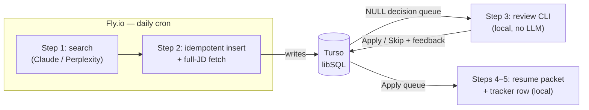

# Job Search Agent

A personal job-search agent, built on the [Claude Agent SDK](https://docs.claude.com/en/api/agent-sdk/overview), that runs a **recurring search** for in-scope roles, stores each posting **exactly once** with its full job description, collects fit feedback through a fast terminal review loop, and turns each `Apply` into a tailored resume packet and a tracker row.

> This repository doubles as a portfolio example of building a real system with AI coding tools. The design was worked out as a written spec **before** any code: [`prd.md`](./prd.md) holds every design decision and its rationale, and [`deep_research_prompt.md`](./deep_research_prompt.md) is the search prompt itself. This README covers how to run the system and how to make it yours; when a paragraph here leaves you asking *why*, the answer is in `prd.md`. See [How this was built](#how-this-was-built).

**Running it for your own job search is the intended use** — everything personal is gitignored or read from the environment. [Using this for your own search](#using-this-for-your-own-search) is the checklist.

## Status

**Working end-to-end.** This repo implements **all five steps** of the PRD:

| Step | What it does | Where it runs |
| --- | --- | --- |
| 1 | Recurring job search — Perplexity Agent API deep research on Mon/Wed/Fri, plus a weekly Claude Deep Research sweep on Fridays | Fly.io cron (headless) |
| 2 | Idempotent insert into Turso + full-JD capture from the posting's own ATS | Fly.io cron (headless) |
| — | Direct job add: hand it a URL, it runs the same Step 2 machinery and is decided `Apply` | Local terminal |
| 3 | Human-in-the-loop fit review (`Apply`/`Skip` + free-text feedback) | Local terminal |
| 4 | Tailor a per-job resume from the `resume_templates/` library (a render-loop agent patches a template and verifies a two-page PDF budget) | Local terminal |
| 5 | Append `Apply` postings to the Google Sheet application tracker (Step 4's final action) | Local terminal |
| — | Learning loops: a weekly PR proposing search-prompt refinements from fit feedback, and a bullet-library sync from the resumes actually sent | GitHub Actions / local |

## Architecture

The system splits a **headless cloud runtime** (the recurring search) from **interactive local sessions** (review, resumes, tracker), coordinated through one hosted database so neither side keeps a divergent copy.


```mermaid
flowchart LR
    subgraph Cloud ["Fly.io — daily cron"]
        S["Step 1: search\n(Claude / Perplexity)"] --> I["Step 2: idempotent insert\n+ full-JD fetch"]
    end
    I -->|writes| DB[("Turso\nlibSQL")]
    DB -->|NULL decision queue| R["Step 3: review CLI\n(local, no LLM)"]
    R -->|Apply / Skip + feedback| DB
    DB -->|Apply queue| G["Steps 4–5: resume packet\n+ tracker row (local)"]
```

- **Fly.io** wakes a machine on schedule, runs one search, and stops — pennies per month.
- **Turso** (hosted, SQLite-compatible libSQL) is the single `postings` table both sides share.
- **Idempotency** is one mechanism: URL canonicalization into a `UNIQUE` constraint with `INSERT … ON CONFLICT DO NOTHING`, so overlapping search windows and re-runs are safe.

## Setup

Requires [uv](https://docs.astral.sh/uv/) and Python 3.12+.

```bash
uv sync                     # create the venv and install dependencies
cp .env.example .env        # then fill in credentials (see below)
```

Credentials (see `.env.example` for details): a Turso database URL + token, Claude auth for every Claude-driven step (`CLAUDE_CODE_OAUTH_TOKEN` from `claude setup-token` on a subscription, or a pay-as-you-go `ANTHROPIC_API_KEY` — never both), a Perplexity API key (the recurring Mon/Wed/Fri search), your own Google Sheet's id in `JSA_TRACKER_SPREADSHEET_ID` for the Step 5 tracker write, and your name in `JSA_CANDIDATE_NAME` for the resume file names. `.env.example` also lists the optional path and tooling overrides.

## Using this for your own search

A clone is a working skeleton. Make it yours in this order:

1. **Rewrite the search prompt.** `deep_research_prompt.md` opens with a
   Candidate section, target titles, and non-negotiable filters (location,
   salary, industry) that describe *my* search — replace those with yours and
   keep the rest: the Sources, Output, and Liveness sections are the
   load-bearing search machinery and are candidate-agnostic. Once you start
   reviewing postings, the weekly [`jsa refine` loop](#refining-the-search-prompt-from-ground-truth)
   keeps tuning the criteria from your own feedback.
2. **Set the search cadence.** `pipeline.CRON_SCHEDULE` maps each ET weekday
   to the searches the cloud cron runs that day. The committed cadence
   (Perplexity Mon/Wed/Fri, a Claude sweep first on Fridays) is a starting
   point, not a requirement.
3. **Seed a resume template library.** `resume_templates/` (gitignored, so you
   start empty) holds one polished `.docx` resume per role family you apply
   to — e.g. `customer-education.docx`. `jsa generate` picks one per job and
   patches it. The tailoring prompt itself is candidate-agnostic; the one
   vocabulary to align is the role-category list shared by
   `tailoring_prompt.md`, `bullet_sync_prompt.md`, and the bullet library.
4. **Seed the vault files.** Three hand-curated files live beside your
   application packets (`~/Documents/Job Applications` by default;
   `JSA_PACKETS_DIR` to move it): `resume_tailoring_rules.md` — constraints
   the tailorer must honor, such as an entry it must never touch or how one
   title may be worded; `resume_voice.md` — summaries you wrote yourself,
   matched for register; and `resume_bullets.csv` — every bullet you have
   sent (build it, then run `jsa bullets --baseline`). Each is optional and
   degrades to a placeholder in the prompt.
5. **Create your own tracker Sheet.** Make a Google Sheet with an
   `Applications` tab whose header row is the eight columns described in
   `prd.md` (Application Tracker), put its id in `JSA_TRACKER_SPREADSHEET_ID`
   in `.env`, and install the [`gws`](https://github.com/googleworkspace/cli)
   CLI (`gws auth login`). There is deliberately no default Sheet id in the
   code — the Sheet-touching commands fail with a pointer here until you set it.
   Publish the OAuth consent screen in the GCP project behind your `gws`
   client, or its refresh token expires every seven days.
6. **Provision your own cloud pieces.** `turso db create` for the database and
   `fly launch` for the search cron — Fly will prompt you for your own app name
   (the committed `fly.toml` carries mine, which is already taken). Both are
   step-by-step in [Deployment](#deployment-flyio--turso); the search runs fine
   locally via `uv run jsa search` before you ever deploy.
7. **Wire the refinement loop's CI.** Add the repo secrets
   `TURSO_DATABASE_URL`, `TURSO_AUTH_TOKEN`, and `CLAUDE_CODE_OAUTH_TOKEN` for
   the weekly refine workflow, and `FLY_API_TOKEN` (`fly tokens create deploy`)
   for the redeploy-on-merge workflow, then enable *Settings → Actions → Allow
   GitHub Actions to create and approve pull requests*.

Two local assumptions worth knowing: `jsa review` opens each posting with
macOS's `open -a "Google Chrome"` (one line to change for another OS or
browser), and `jsa generate` renders PDFs with LibreOffice, so it needs
`soffice` on PATH.

## Usage

```bash
uv run jsa init-db                              # create the postings table
uv run jsa search                              # run one search (defaults to Perplexity, 48h window)
uv run jsa search --agent claude --window-hours 72   # explicit agent + window
uv run jsa add https://job-boards.greenhouse.io/acme/jobs/123   # add one posting by hand
uv run jsa review                              # work through the fit-review backlog
uv run jsa refetch --dry-run                   # report drift on Apply postings not yet applied to
uv run jsa packet --dry-run                    # preview the application-packet directories
uv run jsa generate --dry-run                  # preview the resume-generation queue
uv run jsa generate                            # tailor resumes + append to the tracker
uv run jsa bullets --dry-run                   # list resumes newer than the last bullet-library sync
uv run jsa bullets                             # fold new resumes' bullets into the ground-truth library
uv run jsa refine --dry-run                    # preview the prompt-refinement scope
uv run jsa track --dry-run                     # preview the tracker rows
uv run jsa track                               # append Apply postings to the Sheet
```

### Adding a posting by hand

`jsa add <URL>` runs a posting you found yourself through the same pipeline as
a searched one, tagged `search_agent = 'manual'`, and **decides it `Apply` on
arrival** — supplying the URL is the decision, so it skips review and goes
straight into the Step 4/5 queue. Re-adding a URL already in the table
promotes that row to `Apply` (keeping any feedback you wrote), which is how
you reverse an earlier `Skip`. Company and title are pre-filled from the ATS
record for you to correct; `--company` / `--title` set them outright and
`--no-input` skips the prompts. A URL on an unsupported ATS still works: the
job description is captured from the page's schema.org JSON-LD when the
platform's own record is unavailable (`prd.md`, Direct Job Add).

### Reviewing

`jsa review` walks the backlog, opening each posting in Chrome. Decisions are
revisable, because articulating *why* a role is a Skip is often what reveals
it's an Apply:

| Key | Where | What it does |
| --- | --- | --- |
| `a` / `s` | decision prompt | Apply / Skip |
| `b` | decision prompt | step back to the previous posting and reopen it (Enter keeps its decision; its comment is pre-filled for editing) |
| `q` | decision prompt | stop (everything already decided is saved) |
| `:a` / `:s` | feedback prompt | change the decision; text typed after the command is kept as the comment |
| `:b` | feedback prompt | discard and return to the decision prompt |

At the end of the backlog you get one more chance to amend the last entry. The
prompts have real line editing — arrow keys, ⌥+delete, ^W, ^A/^E — and
Ctrl-X Ctrl-E opens `$EDITOR` for a long comment.

### Keeping postings in sync

Employers edit reqs in place under an unchanged URL. `jsa refetch` re-reads the
ATS record for `Apply` postings you have not applied to yet (absent from the
tracker Sheet, or there without a `Date Applied`) and re-applies the insert's
rule: the ATS-canonical title wins, with the description and location
refreshed alongside. A corrected title is written back to the tracker row's
Title cell, and a job that already has a packet directory is rebuilt —
resume included — at its new path before the old one is removed. A failed
fetch leaves the row untouched, and a posting that has vanished from its
board is reported, not deleted (`prd.md`, Posting Drift and Re-fetch).

```bash
uv run jsa refetch --dry-run   # what has changed upstream, without writing
uv run jsa refetch             # reconcile Apply postings not yet applied to
uv run jsa refetch --all       # every stored row, regardless of decision or tracker state
uv run jsa refetch --id 42     # one row, selected unconditionally
```

### Preparing application packets

`jsa packet` creates the per-job directory
`~/Documents/Job Applications/{Company} - {Title}` and writes the captured job
description inside as `job_posting.md` — the deterministic first half of
Step 4, for when you want the directory and JD on disk without a model call.
An existing packet is skipped, never clobbered; `--id` builds the packet for a
row that is already tracked.

```bash
uv run jsa packet --dry-run    # what would be created
uv run jsa packet --id 42      # one packet, even if the row is already tracked
```

### Generating resumes

`jsa generate` is Step 4. For each `Apply` posting not yet in the tracker it
ensures the packet directory, tailors the best-fit template from your
`resume_templates/` library with a headless render-loop agent, and writes the
tailored resume as `.docx` **and** `.pdf` plus a `resume_changelog.md` with
one entry per change and its rationale. The model never edits a file: it
submits structured patches to a tool that applies them to a fresh copy of the
template, renders the PDF, and reports the page count back, iterating until
the resume fits a hard **two-page budget**. When no template's role family
fits, the tailored result is saved back as a new template, flagged for review
(`prd.md`, Resume Revisions).

A row with no captured JD is skipped, never tailored blind — run
`jsa refetch --id 42`, or paste the JD into the packet's `job_posting.md` by
hand and re-run (that file is treated as input and never overwritten). As its
final action, `jsa generate` appends the row to the tracker Sheet (Step 5), so
a job reaches the tracker only once a resume was actually drafted. The queue
runs on a small worker pool (`JSA_GENERATE_WORKERS`, default 3); `--id`
regenerates one row even if it's already tracked.

Requires the `resume_templates/` library and LibreOffice (`soffice`) on PATH;
the vault files from the checklist above are optional inputs.

```bash
uv run jsa generate --dry-run  # preview the queue
uv run jsa generate            # tailor + track everything queued
uv run jsa generate --id 42    # one row, even if already tracked
```

### Maintaining the bullet library

`resume_bullets.csv` — beside the packet directories — records every bullet
across every resume actually sent, one canonical wording per claim with
substantively different framings kept as variants. `jsa generate` feeds it to
the tailoring model so new resumes reuse vetted claims instead of
re-paraphrasing them. `jsa bullets` keeps it current: it scans for resume
files modified since the last recorded sync and has a headless agent fold the
missing bullets into the CSV.

```bash
uv run jsa bullets --dry-run   # list the resumes in scope
uv run jsa bullets             # fold their bullets into the library
uv run jsa bullets --baseline  # mark the current state as synced (after hand-curation)
```

### Refining the search prompt from ground truth

Every review decision — and every JD behind it — is labeled training data for
the search prompt. A weekly GitHub Actions workflow runs `jsa refine`: it
pulls only the postings decided since the last run, hands the refiner agent
the feedback, the hand-added postings the search missed, and the full JDs to
mine for implicit patterns, and opens a **pull request** with whatever prompt
edits it proposes. Nothing merges without human review. The same loop runs by
hand as `uv run jsa refine`; `--dry-run` previews the scope.

### Elevating to the tracker

`jsa track` appends every `Apply` posting that isn't in the tracker yet to the
Google Sheet and flags the row only after the Sheets API confirms the append,
so a failure leaves the posting in the backlog rather than silently dropping
it. Each row leads with the database id (column A), which is how `jsa refetch`
matches Sheet rows back to postings. The write shells out to the local
[`gws`](https://github.com/googleworkspace/cli) CLI, which holds the Google
OAuth token — that credential stays off the Fly.io server by design. If `gws`
reports an expired grant, re-run `gws auth login`.

```bash
uv run jsa track --dry-run     # print the exact rows without writing
uv run jsa track --id 42       # elevate one posting
```

## Deployment (Fly.io + Turso)

Steps 1–2 run headless on a Fly.io Machine that wakes daily, runs one search, and
stops. Steps 3–5 run locally against the same Turso database.

> The commands below are run **by you** — they create billed accounts and set
> secrets that must never pass through an agent transcript.

**1. Turso database.** Install the [Turso CLI](https://docs.turso.tech/cli/installation), then:

```bash
turso auth signup
turso db create job-search-agent
turso db show job-search-agent --url          # -> TURSO_DATABASE_URL
turso db tokens create job-search-agent       # -> TURSO_AUTH_TOKEN
```

Put both in your local `.env`, then `uv run jsa init-db` to create the table.

**2. Claude + Perplexity auth.** Every Claude service here (the weekly deep-research
search, `jsa generate`, `jsa bullets`, `jsa refine`) drives the Claude Agent SDK, so they
authenticate with a subscription OAuth token from `claude setup-token`, read from
`CLAUDE_CODE_OAUTH_TOKEN` — usage draws from the plan, not per-call API billing.
An [Anthropic API key](https://console.anthropic.com/) in `ANTHROPIC_API_KEY`
also works (pay-as-you-go), but never set both: the CLI prefers
`ANTHROPIC_API_KEY` and 401s if that variable holds an OAuth value. Add a
[Perplexity API key](https://www.perplexity.ai/settings/api) too. Put them in
`.env` for local runs.

**3. Fly app + secrets.** Install [flyctl](https://fly.io/docs/flyctl/install/), then:

```bash
fly auth signup                # or: fly auth login
fly launch --no-deploy         # reuses the committed fly.toml
fly secrets set --stage \      # --stage is required: this app has no `fly deploy` release,
  TURSO_DATABASE_URL="libsql://..." \   # so plain `fly secrets set` fails trying to auto-deploy
  TURSO_AUTH_TOKEN="..." \               # against a release that doesn't exist
  CLAUDE_CODE_OAUTH_TOKEN="sk-ant-oat01-..." \   # `claude setup-token`; don't also set ANTHROPIC_API_KEY
  PERPLEXITY_API_KEY="pplx-..."
```

**4. Smoke-test once, then schedule.** Run a one-off machine (no schedule) and
check logs + new Turso rows before letting the cron ride. `fly machine run`
talks to the Machines API directly and does **not** read `fly.toml`'s `[[vm]]`
block (that's only consumed by `fly deploy`) — pass `--vm-memory` explicitly or
the machine defaults to `shared-cpu-1x` at 256MB, which is not enough headroom
for the Claude Agent SDK's bundled CLI subprocess (it hangs on `initialize`
rather than failing loudly):

```bash
fly machine run . --rm --vm-memory 1024                                  # one-off; runs `jsa cron` once, then exits
fly machine run . --schedule daily --restart on-fail --vm-memory 1024    # wakes daily at ~the creation time (ET)
```

The image's entrypoint is `jsa cron`, which **self-gates by ET weekday** against
`pipeline.CRON_SCHEDULE` and exits quietly on days with no search, so a single
fuzzy `--schedule daily` machine produces the whole weekly cadence — Fly's
scheduler has no weekday selector or per-run args, so the weekday logic lives
in the container. Create the scheduled machine **at your intended morning
hour** (the daily interval fires ~24h after creation). The windows overlap by
design, so a missed or doubled fuzzy fire is harmless — re-inserts no-op on
`canonical_url`. Per-agent attribution lands in `search_findings` as raw
telemetry for search-quality evaluation (the `analysis/` R script is one
example); the pipeline ships no built-in report over it.

> **Cost note:** watch the first few Friday (Claude Opus) runs' spend before
> trusting the cron unattended.

**5. Update the running cron after a code or prompt change.** The search prompt
(`deep_research_prompt.md`) and all of `src/` are **baked into the image**, and the
scheduled machine is pinned to the image it was created with — so editing files
locally changes nothing until you build a new image and move that machine onto it.
The build context is your working directory (`.dockerignore` excludes `.git`), so
uncommitted edits are picked up as-is; you don't have to commit before redeploying
(though you should, for history's sake).

Update the machine **in place** — do *not* destroy and recreate it: a fresh
`--schedule` machine re-anchors its daily fire to creation time (~24h out), so
you'd skip the next run.

```bash
# 1. Build + push a new image (no release; machines run registry images directly).
#    The explicit label makes the resulting ref predictable.
fly deploy --build-only --push --image-label prompt-$(date +%Y%m%d)
#    -> registry.fly.io/<app>:prompt-YYYYMMDD

# 2. Find the scheduled machine (the row whose schedule = daily).
fly machine list

# 3. Swap ONLY the image. --vm-memory 1024 is mandatory here too (fly machine *
#    ignores fly.toml's [[vm]] block) or the machine drops to 256MB and hangs on `initialize`.
fly machine update <machine-id> --image registry.fly.io/<app>:prompt-YYYYMMDD --vm-memory 1024

# 4. Confirm: new image, 1GB memory, and schedule still `daily`.
fly machine status <machine-id>
```

An in-place `--image` swap keeps the machine's schedule and restart policy — only
the image changes, and the next scheduled wake runs the new code. If step 4 shows
the schedule was dropped, re-assert it without rebuilding:
`fly machine update <machine-id> --schedule daily --vm-memory 1024`. A full
`fly deploy` release is deliberately **not** used: this app has never had one
(hence the `--stage` secrets above and `--build-only` here, neither of which
creates a release), and a release can normalize the machine against `fly.toml`,
which carries no schedule.

**Automatic redeploy on a merged refinement PR.** The steps above are the
general (and recovery) path for any code or prompt change. For the one change
that happens on a schedule — the weekly ground-truth refinement of
`deep_research_prompt.md` — the redeploy is automated:
`.github/workflows/deploy-on-refine-merge.yml` fires when a `refine/ground-truth-*`
PR merges and runs exactly this procedure (build + push a new image with
`--build-only --push`, then swap the scheduled machine's image in place with
`--vm-memory 1024`, re-asserting `daily` if the update drops it). It needs one
repo secret, `FLY_API_TOKEN` (`fly tokens create deploy`); the billed account
setup and `fly secrets set` above stay manual. Merging any other PR does not
redeploy — a code change ships on the next manual run of the steps above.

## How this was built

This repo is also a worked example of how I build with AI coding tools.

**Spec before code.** The system was fully specified in prose before a line of
Python existed. [`prd.md`](./prd.md) is the source of truth and a living
document: it describes the present design and the rationale that holds it up,
rewritten in place as decisions change, with the git log as the only archive.
Load-bearing choices — the cloud/local split, one hosted database with no
copies, a single idempotency mechanism, four supported ATS platforms as an
inclusion criterion — were argued out there, not discovered mid-implementation.

**Plan, then execute in reviewable slices.** Implementation followed an approved
plan built in phases (data layer → ATS capture → search runners → pipeline/CLI
→ review loop → deployment → resume generation → learning loops), each ending
in a green lint pass and a focused commit that references the PRD section it
implements. The git history is meant to be read.

**Verify against reality, not just types.** The four ATS fetchers were validated
live against real public boards before being trusted — which is how the
Rippling detail-record shape and the canonical-title consistency gap were
caught and fixed, with the fixes fed back into `prd.md`. The repo deliberately
ships no agent-authored tests: a suite written in the same loop as the code
only mirrors what that loop already believed, so pure logic is kept I/O-free
and every external tool is overridable for a test suite written separately.

## Project layout

```
src/jsa/
  config.py          env-based configuration (.env locally, Fly secrets in cloud)
  canonicalize.py    URL -> canonical idempotency key (pure)
  naming.py          filesystem-safe company / title-slug derivation (pure)
  models.py          pydantic models for the postings JSON contract
  db.py              the single Turso `postings` table + idempotent insert + migrations
  ats/               full-JD capture: resolve URL -> fetch detail -> HTML->MD (+ JSON-LD fallback)
  search/            Step 1 runners (Claude / Perplexity) + prompt + parser
  pipeline.py        Steps 1->2 orchestration + the weekly cron cadence
  manual.py          direct job add: one user-supplied URL through Step 2
  review.py          Step 3 deterministic review loop
  prompting.py       line-edited terminal input shared by the local commands
  refetch.py         reconcile stored postings against their (mutable) ATS record
  packet.py          Step 4's deterministic head: create + seed the packet directory
  generate.py        Step 4: render-loop resume tailoring (structured patch) + track
  docx_patch.py      applies the tailoring patch to the .docx (pure)
  tracker.py         Step 5 write to the Google Sheet application tracker
  bullets.py         the bullet ground-truth library sync
  refine.py          the ground-truth prompt-refinement loop (weekly PR via CI)
  agent.py           the headless Agent SDK scaffolding shared by generate / bullets / refine
  cli.py             the `jsa` command-line entry point
deep_research_prompt.md   the search prompt (Steps 1-2); baked into the cloud image
tailoring_prompt.md       the resume-tailoring instructions (Step 4)
bullet_sync_prompt.md     the bullet-library reconciliation rules
refine_search_prompt.md   the refiner agent's instructions
analysis/                 an R script over the search_findings telemetry (renv-managed)
```
